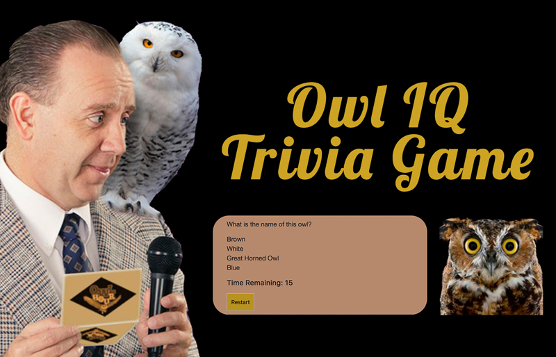

# Owl IQ Trivia Gane

## Overview
Trivia game using JavaScript for the logic and jQuery to manipulate HTML. This was an exercise in dynamically generating HTML elements using JavaScript and jQuery. In addition, using timers and counters in JavaScript.

## Home Page

## Player Instructions
* The player will have a limited amount of time to finish the quiz.

* The game ends when the time runs out. The page will reveal the number of questions that players answer correctly and incorrectly.

* Only pick one answer per question

* Includes a coutdown timer

## See it online at:
https://akt12345.github.io/TriviaGame/

## Technologies Used:
HTML5

Bootstrap

CSS

JavaScript

JQuery

## Author
Abby Thoresen copyright 2018

Photo Credits to: Brad Wilson
website credits to: Audubon Society http://www.audubon.org/magazine/january-february-2015/whos-who
